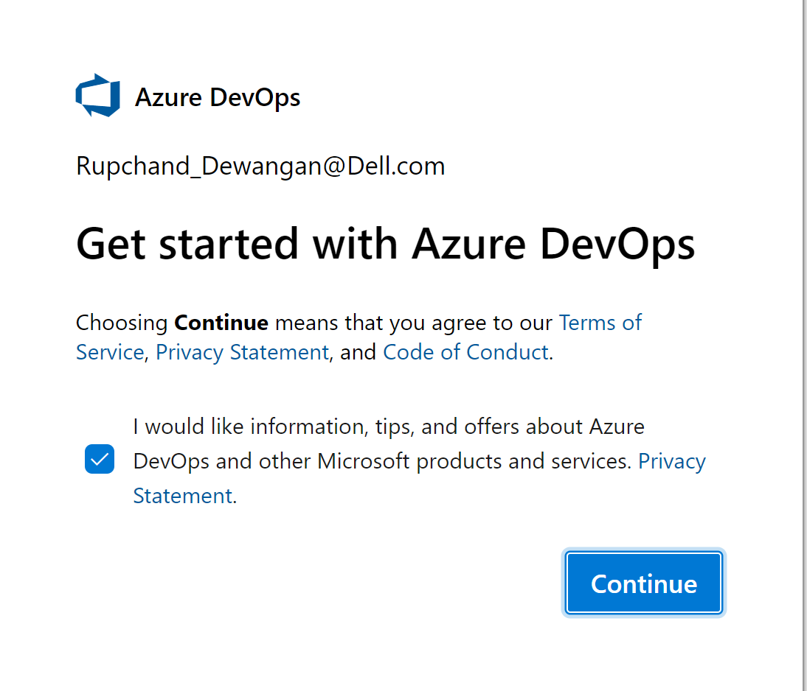
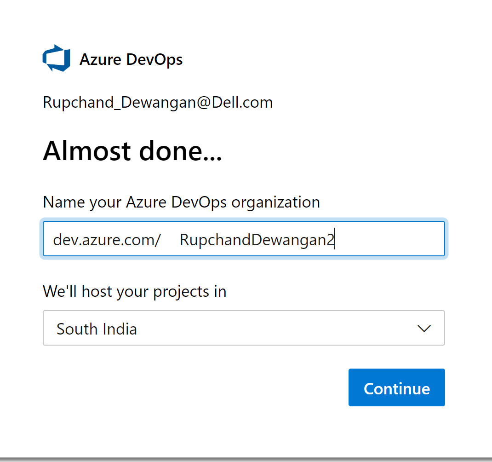
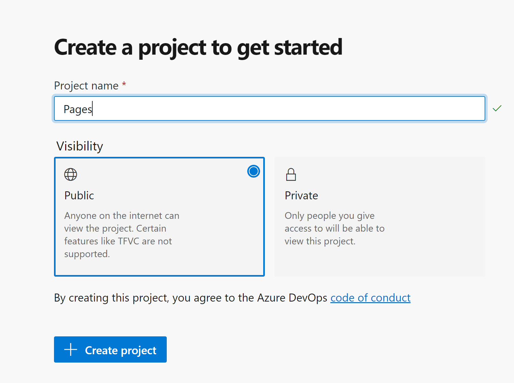
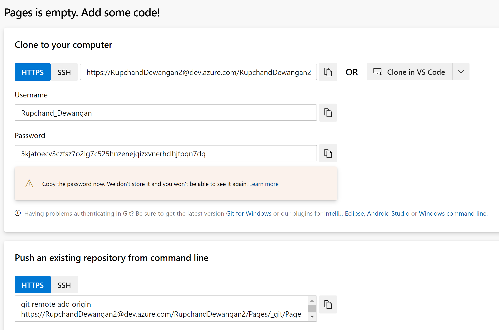
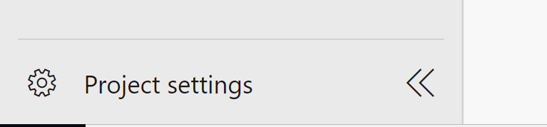
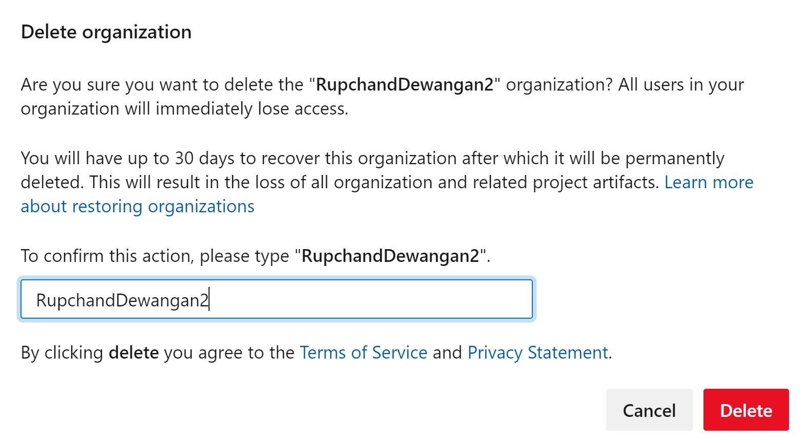
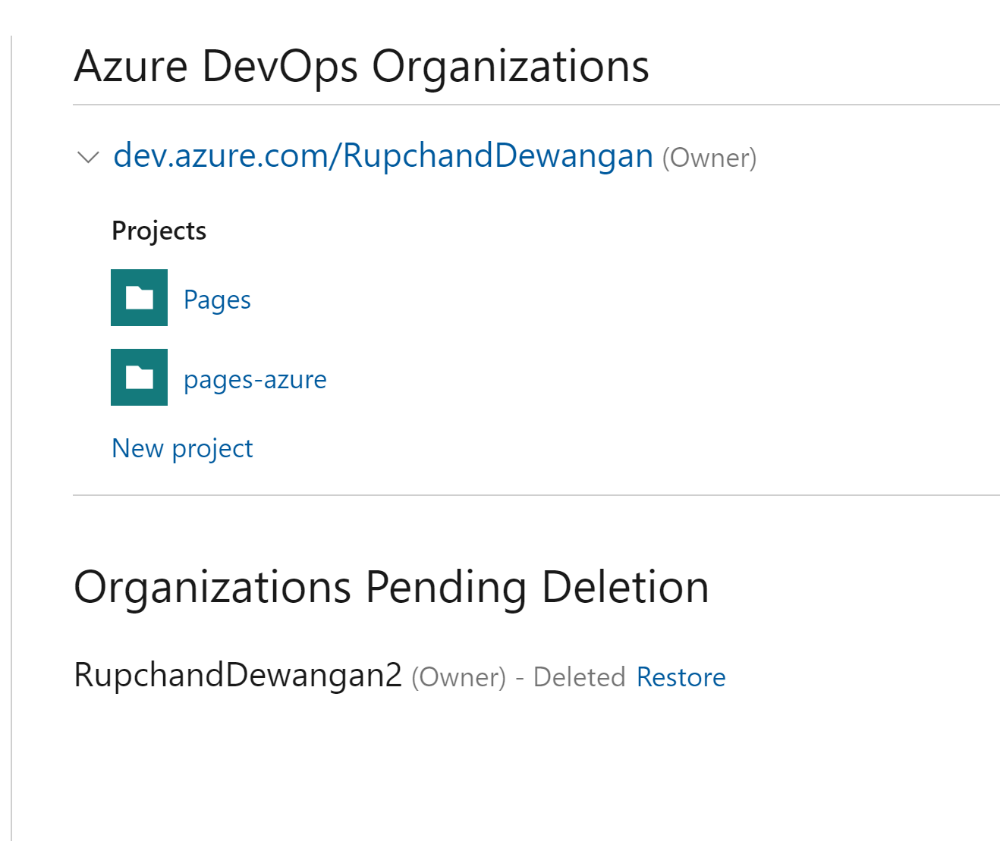

Azure DevOps

Follow the below steps to create project in DevOps.

1.	Login into Azure account and search “Azure DevOps organizations” and click on it.

2. We need to create an organization in the Azure DevOps before we start using Azure DevOps services. 

Click on create new organization to utilize Azure DevOps services.

 

3.	Click on continue 

 

Provide the name of the organization and select region where you want 
to host your projects.

4.	Then click on continue. We have created an organization in Azure DevOps.
We will create a Project first in Azure DevOps Dashboard for newly created organization.

 

5. Provide a Project name and select the Visibility of the project.  Click on Create project.
Once our project is ready, we can use Azure DevOps services for CICD implementation.

6.	Click on Repos. We will need application code to operate on it, you can generate credential which can be used while performing GIT operation like Push, pull etc.
 

Note – Please store the password somewhere as a reference which can be used throughout workshop.

7.	Below is the command which can be used to set remote git URL before pushing into Azure GIT.
It will be applicable lab 1st onwards.

git remote add origin https://RupchandDewangan2@dev.azure.com/RupchandDewangan2/Pages/_git/Pages

8.	If due to any reason, if you want to delete the organization, then follow steps.

Go to project settings at the bottom of the page and search for delete organization 

 

 

 

Once delete, you won’t be able to use it until re-store.
 

