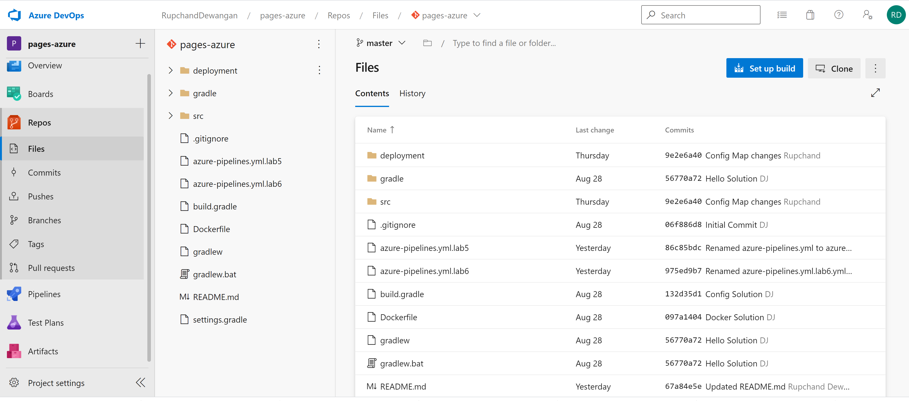

Building pipleine for your containers

This lab demonstrates Azure Git pipeline, which provides the ability to do continuous integration/continuous delivery (CI/CD) from within your Github projects.The lab will lead you through the anatomy of how Azure pipeline solve this problem.
Build pipeline for Kubernetes usually contains the steps that will fetch the code, build the Docker image, push that image to your Docker repository and then publish the artifacts and deploy them into AKS.

1. Create service connection Docker registry - 

   Login into azure account and navigate to project created by you. Go to project setttings bottom of the page. 

 

2. Click on Service connections and select new service connection.

 

3. Search Docker Registry and select.

4. select register type, select Docker hub for public docker image.

 

5. Create new pipeline and select code base repos and tool which is being used for building the project. In our case, Gradle is being used to build the project. 

 

6. select a source.

 

7. select code base.

 

8. select a repository.

 

9. Configuring pipeling.

 

10.

